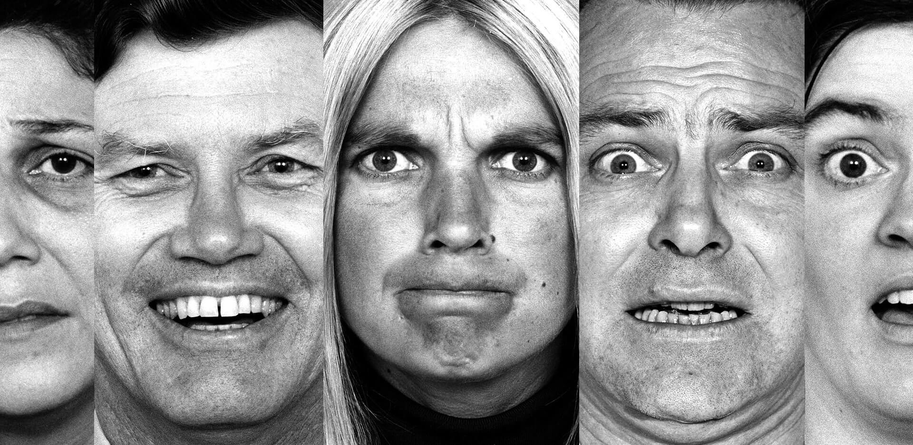

# Recognition of Emotions Manifested Through Facial Expressions

A computer vision system for real-time human emotion recognition through facial expressions, built on **YOLO26** single-stage object detection architectures. This project compares multiple model configurations across accuracy, speed, and robustness dimensions.



> **Academic Proposal:**
> * Realizzazione di un sistema in grado di riconoscere le diverse emozioni manifestate tramite espressioni facciali.
> * Ricerca dello stato dell'arte per poi confrontare almeno due diversi approcci.

---

## 📋 Table of Contents

- [Overview](#overview)
- [Project Structure](#project-structure)
- [Dataset](#dataset)
- [Models](#models)
- [Results](#results)
- [Installation](#installation)
- [Usage](#usage)
- [Known Limitations](#known-limitations)

---

## Overview

This project implements an end-to-end Facial Emotion Recognition (FER) pipeline that classifies six emotional states:

| Emotion | Description |
|---|---|
| 😠 Angry | Facial tension, furrowed brows |
| 😊 Happy | Raised cheeks, visible teeth |
| 😢 Sad | Downturned mouth, drooping eyelids |
| 😲 Surprise | Raised brows, open mouth |
| 😨 Fear | Wide eyes, raised upper eyelids |
| 😐 Neutral | Resting facial baseline |

Unlike traditional multi-stage pipelines that require separate face detection and landmark extraction steps, this framework treats emotion recognition as a **single-stage, end-to-end task**, mapping raw pixels directly to emotional states in one forward pass.

---

## 📁 Project Structure

```text
facial_emotion_recognition/
├── assets/               # Images and media for the README
├── datasets/             # Dataset configurations and combined dataset splits
│   └── combined_dataset/
│       ├── data.yaml     # YOLO training configuration
│       ├── train/        # Training images and labels
│       ├── valid/        # Validation images and labels
│       └── test/         # Test images and labels
├── notebooks/            # All scripts and exploratory notebooks
│   ├── board_game.py   # Comparative benchmark across all 4 models
│   ├── train.py              # YOLO training script
│   └── inference.py          # Real-time inference via webcam or video file
├── runs/                 # Training outputs (weights, metrics, confusion matrices)
├── papers/               # Academic paper (LaTeX source + PDF)
├── LICENSE
└── README.md
```

---

## Dataset

The training corpus was built by fusing **four heterogeneous open-source repositories** from [Roboflow Universe](https://universe.roboflow.com), specifically engineered to anchor the `neutral` baseline class that is systematically absent from most public FER datasets.

| Emotion | Train | Validation | Test | Total |
|---|---|---|---|---|
| Angry | 2082 | 203 | 109 | 2394 |
| Happy | 2334 | 221 | 127 | 2682 |
| Sad | 1976 | 192 | 107 | 2275 |
| Surprise | 1740 | 209 | 109 | 2058 |
| Neutral | 1277 | 290 | 140 | 1707 |
| Fear | 1263 | 257 | 146 | 1666 |
| **Total** | **10672** | **1372** | **738** | **12782** |

A custom Python pipeline handled class index remapping across datasets to prevent label collision, and unique filename prefixes (`ds1_`, `ds3_`, `ds4_`) were appended to avoid file overwrites.

---

## Models

Four configurations were evaluated in the ablation study:

| Model | Resolution | Notes |
|---|---|---|
| `YOLO8n` | 640×640 | Legacy baseline |
| `YOLO26n` | 640×640 | Modernized architecture, same capacity |
| `YOLO26s` | 640×640 | Capacity scaled (Nano → Small) |
| `YOLO26n` | 1280×1280 | High-resolution variant |

Trained on a cloud-based **NVIDIA Tesla T4 GPU** via Google Colab, 10 epochs, batch size 16.

---

## Results

| Model | Precision | Recall | mAP@0.5 | Avg FPS |
|---|---|---|---|---|
| YOLO8n 640 | 0.89 | 0.90 | 92.7% | 10.2 |
| YOLO26n 640 | 0.88 | 0.90 | 92.7% | 10.2 |
| YOLO26s 640 | **0.91** | **0.90** | **93.1%** | ~8.0 |
| YOLO26n 1280 | 0.88 | 0.86 | 91.1% | 2.4 |

**Key findings:**
- `YOLO26s 640` achieves the best mAP@0.5 (93.1%) and is recommended for accuracy-critical applications.
- `YOLO26n 640` offers the best speed/accuracy trade-off for real-time use.
- `YOLO26n 1280` provides the highest temporal stability in video tracking at the cost of throughput.
- All models struggle with subjects wearing **thick-rimmed eyeglasses** due to domain shift — ocular features are occluded, causing the network to default to `neutral`.

---

## Installation

Clone the repository and install dependencies:

```bash
git clone https://github.com/martinsoteIo/facial-emotion-recognition.git
cd facial-emotion-recognition
pip install -r requirements.txt
```

---

## Usage

### Training

```bash
python notebooks/train.py
```

### Real-time inference (image)

```bash
python notebooks/inference.py
```

### Benchmark all 4 models on a video fragment

```bash
# Default: first 30 seconds, conf=0.25
python notebooks/board_game.py

# Custom segment and confidence
python notebooks/board_game.py --start 60 --duration 45 --conf 0.25

# Force a specific input resolution for all models
python notebooks/board_game.py --conf 0.20 --imgsz_override 1280

# Skip the 2x2 grid video (faster)
python notebooks/board_game.py --no_grid
```

The benchmark generates:
- Individually annotated videos per model (`*_annotated.mp4`)
- A comparative emotion timeline chart (`benchmark_comparison.pdf`)
- A summary CSV with FPS, detections, and coverage (`benchmark_summary.csv`)
- A side-by-side 2×2 grid video (`benchmark_grid_2x2.mp4`)

---

## Known Limitations

- **Eyeglasses / ocular occlusion:** Thick frames and lens reflections introduce artificial edge gradients that occlude critical ocular features. All models default to `neutral` in these cases. Future work will address this via augmented training data with occluded subjects.
- **Training duration:** Models were trained for 40 epochs due to cloud GPU session constraints.
- **Dataset bias:** The corpus consists primarily of frontal, unoccluded faces. Performance may degrade on extreme head poses or low-light conditions.

---

## Authors

Martín Sotelo Aguirre, Antonio Costantino Marceddu, Filippo Gandino

---

## License

This project is licensed under the terms of the MIT LICENSE.
